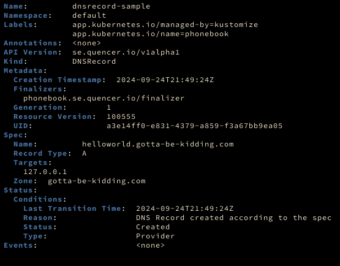

Phonebook is a Kubernetes Operator that lets you manage DNS Record like any other resource in Kubernetes -- Deployments, Services, etc. You can safely create and delete DNS Record from `kubectl` and it will do the right thing.

```yaml
# This will create a new `A` record `helloworld.gotta-be-kidding.com` pointing
# at `127.0.0.1``
apiVersion: se.quencer.io/v1alpha1
kind: DNSRecord
metadata:
  name: dnsrecord-sample
  namespace: phonebook-system
spec:
  zone: gotta-be-kidding.com
  recordType: A
  name: helloworld
  targets:
    - 127.0.0.1
    - 127.0.0.2 # If provider supports multi-target    
```



## Features

- Only manage DNS Record that are presents as DNSRecord in the cluster
- Manage DNS Record like any other resources (Create/Delete)
- Support all DNS Record Types (A, AAAA, TXT, CNAME, etc.)
- Support cloud provider specific properties 
- Proper error handling per DNS Record
- Allows specifying TTL
- Allows multiple targets on providers with multi support (Azure, AWS)

## Providers

- Cloudflare
- AWS
- Azure

Phonebook is built to be cloud agnostic with the goal to support as many cloud providers as [external-dns](https://github.com/kubernetes-sigs/external-dns). Obviously, the list is long and each integration requires efforts to support. If you'd like to have support for your provider, please create an [issue](https://github.com/pier-oliviert/phonebook/issues/new)!

The [provider]() section offers documentation for each of the supported provider.
